# Optymalizatory i funkcje kosztu - podejście techniczne

Ten plik uzupełnia materiały o bardziej formalne spojrzenie na funkcje kosztu i optymalizatory. Celem jest zrozumienie, co model minimalizuje, skąd biorą się gradienty i jak różne algorytmy aktualizują parametry.

Uwaga praktyczna: GitHub renderuje wzory LaTeX zapisane między `$$ ... $$`, więc właściwe równania są poniżej podane w LaTeX-u. Diagramy Mermaid zostają jako bardziej ludzka intuicja: pokazują, co wchodzi do wzoru, co jest liczone po drodze i co jest wynikiem.

---

## 1. Notacja

Najczęściej spotykane oznaczenia:

- `x` - wektor cech wejściowych,
- `y` - prawdziwa wartość albo prawdziwa klasa,
- `y_hat` / `\hat{y}` - predykcja modelu,
- `theta` / `\theta` - parametry modelu, np. wagi i biasy,
- `L(y, \hat{y})` - strata dla jednej próbki,
- `J(\theta)` - funkcja kosztu dla całego zbioru,
- `N` - liczba próbek,
- `eta` / `\eta` - learning rate,
- `grad J(\theta)` / `\nabla_\theta J(\theta)` - gradient funkcji kosztu względem parametrów.

Ogólna postać uczenia modelu w LaTeX-u:

$$
D = \{(x_i, y_i)\}_{i=1}^{N}
$$

$$
\hat{y}_i = f_\theta(x_i)
$$

$$
J(\theta) = \frac{1}{N} \sum_{i=1}^{N} L(y_i, f_\theta(x_i))
$$

Ten sam proces jako diagram:

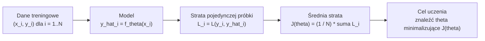

Uczenie modelu polega na znalezieniu takich parametrów `theta`, które minimalizują `J(theta)`.

---

## 2. Gradient i intuicja optymalizacji

Gradient wskazuje kierunek najszybszego wzrostu funkcji. Jeśli chcemy minimalizować funkcję kosztu, aktualizujemy parametry w kierunku przeciwnym do gradientu:

$$
\theta_{t+1} = \theta_t - \eta \nabla_\theta J(\theta_t)
$$

Diagram kroków:

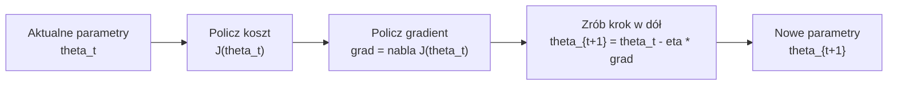

Interpretacja:

- `theta_t` - parametry w kroku `t`,
- `eta` - długość kroku,
- `nabla J(theta_t)` - kierunek, w którym koszt rośnie najszybciej,
- minus przed gradientem oznacza ruch w stronę spadku kosztu.

Jeżeli `eta` jest zbyt duże, optymalizacja może przeskakiwać minimum albo się rozbiegać. Jeżeli `eta` jest zbyt małe, uczenie może być bardzo wolne.

---

## 3. Funkcje kosztu dla regresji

### 3.1. Mean Squared Error - MSE

Wzór dla jednej próbki:

$$
L(y, \hat{y}) = (y - \hat{y})^2
$$

Wzór dla całego zbioru:

$$
J(\theta) = \frac{1}{N} \sum_{i=1}^{N} (y_i - \hat{y}_i)^2
$$

Diagram intuicyjny:

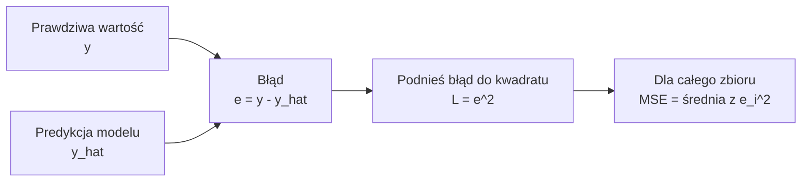

Pochodna po predykcji:

$$
\frac{\partial L}{\partial \hat{y}} = 2(\hat{y} - y)
$$

Co to oznacza:

- duże błędy są karane bardzo mocno, bo błąd jest podnoszony do kwadratu,
- MSE jest wrażliwe na wartości odstające,
- dobrze pasuje do sytuacji, gdzie duże błędy są szczególnie niepożądane.

W PyTorch:

```python
criterion = torch.nn.MSELoss()
```

### 3.2. Mean Absolute Error - MAE

Wzór LaTeX:

$$
J(\theta) = \frac{1}{N} \sum_{i=1}^{N} |y_i - \hat{y}_i|
$$

Diagram intuicyjny:

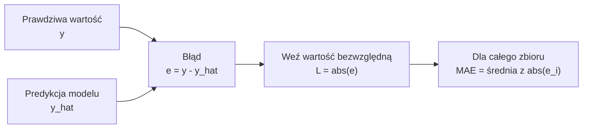

Co to oznacza:

- każdy błąd jest karany liniowo,
- MAE jest odporniejsze na wartości odstające niż MSE,
- gradient ma stałą wartość poza punktem `y = y_hat`, więc optymalizacja może być mniej gładka.

W PyTorch:

```python
criterion = torch.nn.L1Loss()
```

### 3.3. Huber loss

Huber loss łączy MSE dla małych błędów i MAE dla dużych błędów.

Dla błędu:

$$
a = y - \hat{y}
$$

wzór ma postać:

$$
L_\delta(a) =
\begin{cases}
\frac{1}{2}a^2, & \text{gdy } |a| \le \delta \\
\delta(|a| - \frac{1}{2}\delta), & \text{gdy } |a| > \delta
\end{cases}
$$

Działanie w formie decyzji:

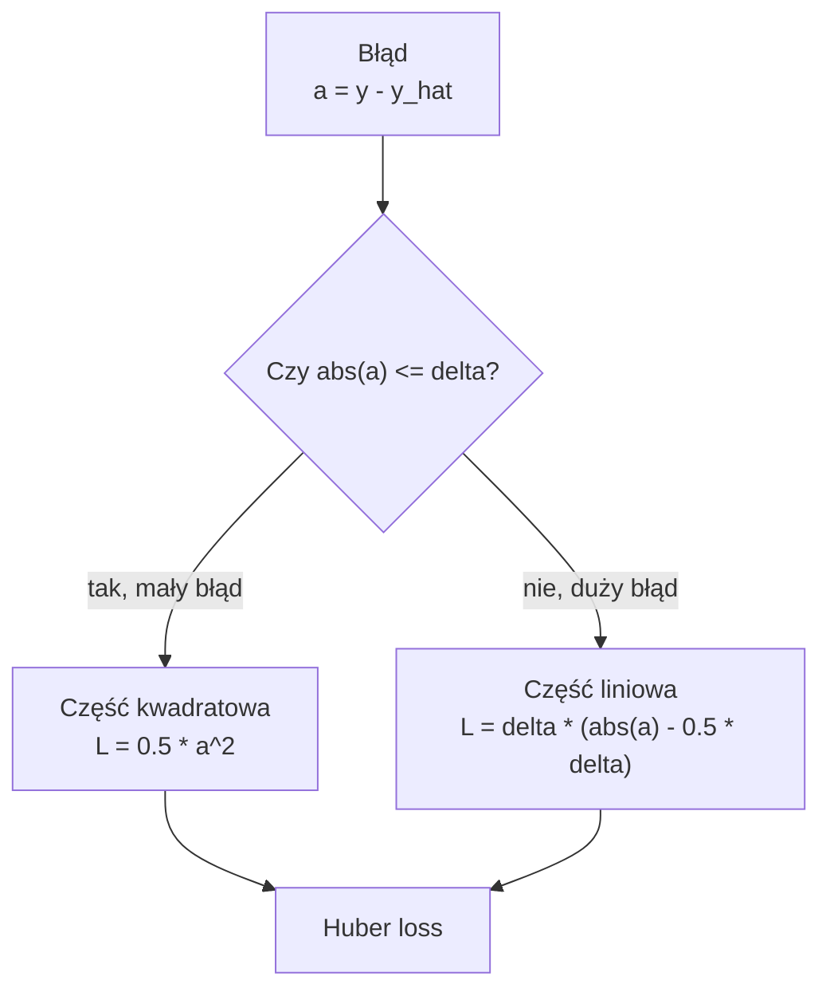

Interpretacja:

- dla małych błędów działa jak MSE i jest gładka,
- dla dużych błędów działa bardziej jak MAE,
- parametr `delta` decyduje, od jakiego błędu strata przechodzi z kwadratowej w liniową.

W PyTorch:

```python
criterion = torch.nn.HuberLoss(delta=1.0)
```

---

## 4. Funkcje kosztu dla klasyfikacji binarnej

### 4.1. Sigmoid i prawdopodobieństwo klasy pozytywnej

W klasyfikacji binarnej model często zwraca logit `z`, czyli surowy wynik przed aktywacją. Sigmoid zamienia logit na prawdopodobieństwo:

$$
p = \sigma(z) = \frac{1}{1 + e^{-z}}
$$

Diagram intuicyjny:

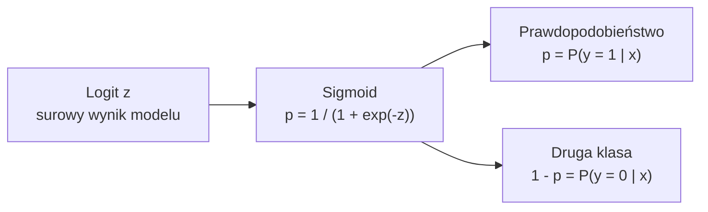

gdzie:

- `p` jest interpretowane jako `P(y = 1 | x)`,
- `1 - p` jest interpretowane jako `P(y = 0 | x)`.

### 4.2. Binary cross-entropy - BCE

Dla etykiety `y` należącej do `{0, 1}` i predykcji `p`:

$$
L(y, p) = -\left[y\log(p) + (1-y)\log(1-p)\right]
$$

Diagram intuicyjny:

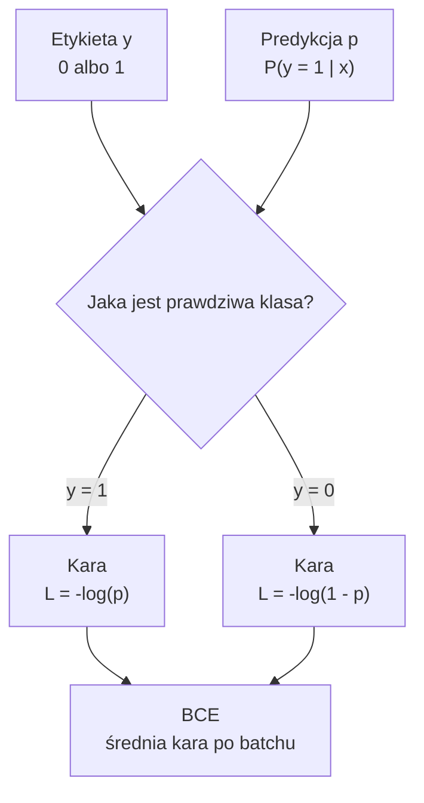

Przypadki:

- gdy `y = 1`, wtedy `L = -log(p)`,
- gdy `y = 0`, wtedy `L = -log(1 - p)`.

Intuicja:

- jeśli prawdziwa klasa to `1`, model jest mocno karany za niskie `p`,
- jeśli prawdziwa klasa to `0`, model jest mocno karany za wysokie `p`,
- bardzo pewna, ale błędna predykcja daje dużą stratę.

### 4.3. BCE z logitami

W praktyce numerycznie stabilniej jest nie liczyć osobno sigmoidy i BCE. Zamiast tego podaje się logity bezpośrednio do funkcji kosztu.

W PyTorch:

```python
criterion = torch.nn.BCEWithLogitsLoss()
logits = model(x)              # shape: [batch] albo [batch, 1]
loss = criterion(logits, y.float())
```

Dlaczego to jest lepsze:

- `BCEWithLogitsLoss` łączy sigmoid i BCE w jednej stabilnej operacji,
- zmniejsza ryzyko problemów z `log(0)`,
- model podczas treningu powinien zwracać logity, nie prawdopodobieństwa.

Predykcja po treningu:

```python
prob = torch.sigmoid(logits)
pred = (prob >= 0.5).long()
```

### 4.4. Ważona BCE przy niezbalansowanych klasach

Gdy klasa pozytywna jest rzadka, można zwiększyć jej wagę:

```python
criterion = torch.nn.BCEWithLogitsLoss(pos_weight=torch.tensor([w]))
```

`pos_weight > 1` zwiększa karę za pomyłki na klasie pozytywnej. Może poprawić recall klasy mniejszościowej, ale często obniża precision, dlatego trzeba kontrolować metryki i próg decyzyjny.

---

## 5. Funkcje kosztu dla klasyfikacji wieloklasowej

### 5.1. Softmax

Model dla `K` klas zwraca wektor logitów:

$$
z = [z_1, z_2, \ldots, z_K]
$$

Softmax zamienia logity na prawdopodobieństwa:

$$
p_k = \frac{e^{z_k}}{\sum_{j=1}^{K} e^{z_j}}
$$

Diagram intuicyjny:

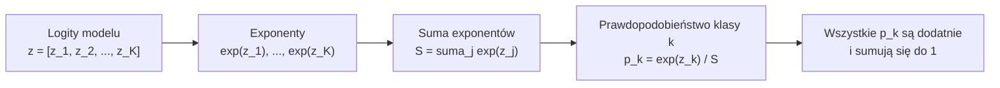

Właściwości:

- każde `p_k` jest dodatnie,
- suma wszystkich `p_k` wynosi 1,
- większy logit oznacza większe prawdopodobieństwo klasy.

### 5.2. Cross-entropy

Jeżeli prawdziwa klasa ma indeks `c`, strata wynosi:

$$
L = -\log(p_c)
$$

Dla etykiety one-hot `y`:

$$
L(y, p) = -\sum_{k=1}^{K} y_k \log(p_k)
$$

Diagram intuicyjny:

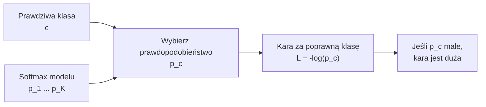

czyli model jest karany za niskie prawdopodobieństwo przypisane poprawnej klasie.

Ponieważ tylko jedna wartość `y_k` jest równa 1, wzór redukuje się do `-log(p_c)`.

### 5.3. CrossEntropyLoss w PyTorch

W PyTorch:

```python
criterion = torch.nn.CrossEntropyLoss()
logits = model(x)              # shape: [batch, num_classes]
loss = criterion(logits, y)    # y shape: [batch], dtype: torch.long
```

Ważne:

- model zwraca logity,
- nie dodajemy `Softmax` w ostatniej warstwie przed `CrossEntropyLoss`,
- etykiety powinny być indeksami klas, np. `0`, `1`, `2`, a nie one-hot,
- `CrossEntropyLoss` wewnętrznie łączy `LogSoftmax` i `NLLLoss`.

Predykcja po treningu:

```python
prob = torch.softmax(logits, dim=1)
pred = torch.argmax(prob, dim=1)
```

### 5.4. Wagi klas

Przy niezbalansowanych klasach można użyć wag:

```python
weights = torch.tensor([1.0, 2.5, 4.0])
criterion = torch.nn.CrossEntropyLoss(weight=weights)
```

Większa waga klasy oznacza większą karę za błędy na tej klasie.

---

## 6. Hinge loss i SVM

Dla klasyfikacji binarnej w SVM często zapisuje się etykiety jako `y` należące do `{-1, 1}`. Dla wyniku modelu `f(x)` hinge loss ma postać:

$$
L(y, f(x)) = \max(0, 1 - y f(x))
$$

Diagram intuicyjny:

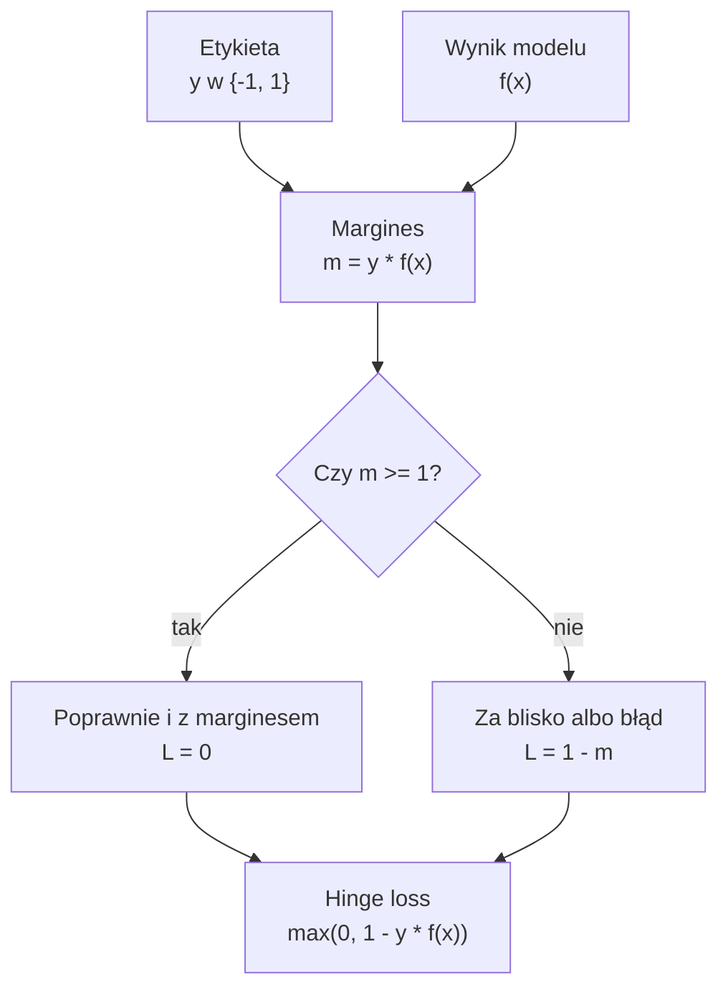

Interpretacja:

- jeśli `y * f(x) >= 1`, próbka jest poprawnie sklasyfikowana z wystarczającym marginesem i strata wynosi 0,
- jeśli `y * f(x) < 1`, próbka jest błędna albo zbyt blisko marginesu i pojawia się kara.

W SVM minimalizuje się zwykle:

$$
J(w) = \frac{1}{2} \lVert w \rVert^2 + C \sum_i \max(0, 1 - y_i f(x_i))
$$

Diagram intuicyjny:

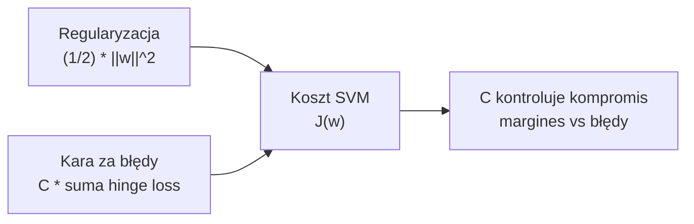

gdzie:

- pierwszy składnik zwiększa margines i działa regularyzująco,
- drugi składnik karze błędy,
- `C` kontroluje kompromis między szerokim marginesem a karaniem błędów.

---

## 7. Regularyzacja jako składnik funkcji kosztu

Regularyzacja zmienia funkcję minimalizowaną przez model:

$$
J_{total}(\theta) = J_{data}(\theta) + \lambda R(\theta)
$$

Diagram intuicyjny:

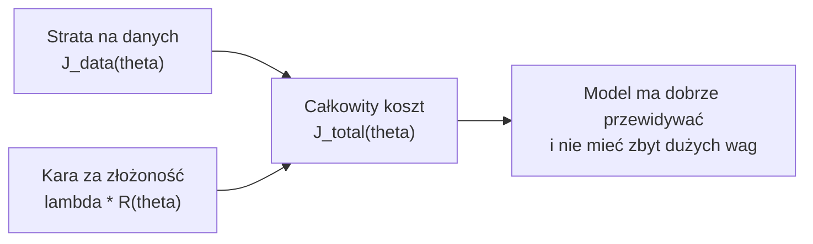

gdzie:

- `J_data` to strata na danych,
- `R(theta)` to kara za złożoność modelu,
- `lambda` kontroluje siłę regularyzacji.

### 7.1. L2

$$
R(\theta) = \sum_j \theta_j^2
$$

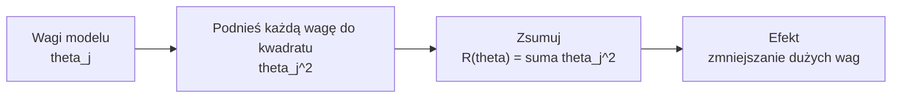

Efekt:

- zmniejsza wartości wag,
- zwykle poprawia stabilność,
- rzadko zeruje wagi całkowicie.

W optymalizatorach PyTorch parametr `weight_decay` zwykle odpowiada regularyzacji L2 albo jej wariantowi odsprzężonemu, zależnie od optymalizatora.

### 7.2. L1

$$
R(\theta) = \sum_j |\theta_j|
$$

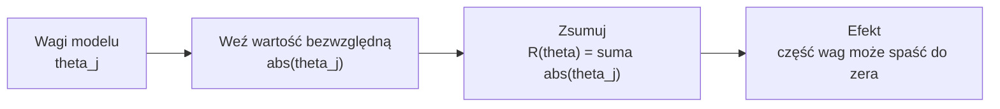

Efekt:

- może wyzerować część wag,
- wspiera selekcję cech,
- bywa użyteczna przy wielu cechach wejściowych.

---

## 8. Gradient Descent, SGD i mini-batch

### 8.1. Batch Gradient Descent

Gradient liczony jest na całym zbiorze:

$$
\theta_{t+1} = \theta_t - \eta \frac{1}{N} \sum_{i=1}^{N} \nabla_\theta L_i(\theta_t)
$$

Diagram intuicyjny:

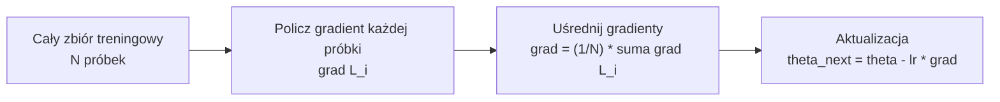

Zalety:

- stabilny kierunek aktualizacji,
- dobrze przy małych danych.

Wady:

- kosztowny dla dużych zbiorów,
- jedna aktualizacja wymaga przejścia przez cały zbiór.

### 8.2. Stochastic Gradient Descent

Gradient liczony jest dla jednej próbki:

$$
\theta_{t+1} = \theta_t - \eta \nabla_\theta L_i(\theta_t)
$$

Diagram intuicyjny:

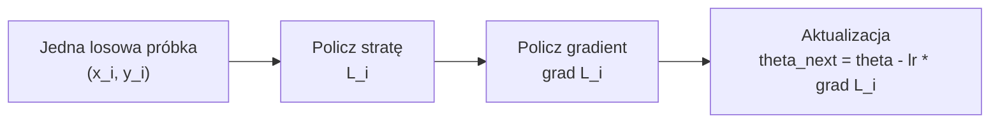

Zalety:

- szybkie aktualizacje,
- szum może pomagać w ucieczce z płytkich minimów.

Wady:

- niestabilna trajektoria uczenia,
- wymaga starannego doboru learning rate.

### 8.3. Mini-batch SGD

Gradient liczony jest dla paczki `B` próbek:

$$
\theta_{t+1} = \theta_t - \eta \frac{1}{|B|} \sum_{i \in B} \nabla_\theta L_i(\theta_t)
$$

Diagram intuicyjny:

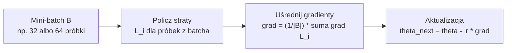

To najczęstszy wariant w uczeniu głębokim.

Typowe hiperparametry:

- `lr` - learning rate,
- `batch_size` - liczba próbek w batchu,
- `momentum` - wykorzystanie poprzedniego kierunku aktualizacji,
- `weight_decay` - regularyzacja wag.

---

## 9. Momentum

Momentum dodaje pamięć poprzednich aktualizacji. Zamiast poruszać się wyłącznie według aktualnego gradientu, model używa prędkości `v`.

Wzory LaTeX:

$$
v_t = \beta v_{t-1} + (1 - \beta) \nabla_\theta J(\theta_t)
$$

$$
\theta_{t+1} = \theta_t - \eta v_t
$$

Diagram intuicyjny:

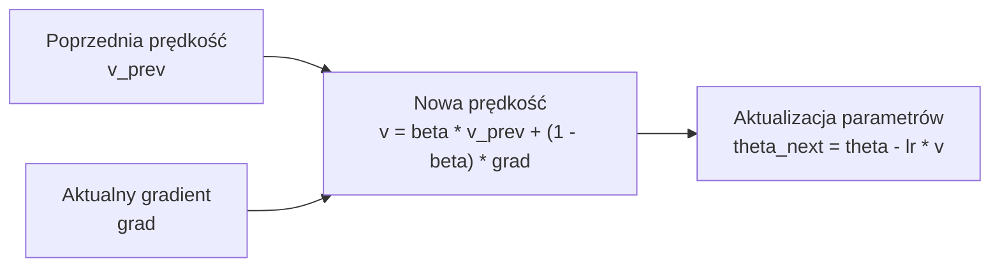

Intuicja:

- wygładza szum gradientów,
- przyspiesza ruch w spójnym kierunku,
- może ograniczyć zygzakowanie w wąskich dolinach funkcji kosztu.

Hiperparametr:

- `momentum`, często około `0.9`.

W PyTorch:

```python
optimizer = torch.optim.SGD(model.parameters(), lr=0.01, momentum=0.9)
```

---

## 10. Nesterov momentum

Nesterov momentum liczy gradient po "spojrzeniu do przodu", czyli w miejscu, do którego prowadzi aktualna prędkość.

Wzory LaTeX:

$$
\theta_{lookahead} = \theta_t - \eta \beta v_{t-1}
$$

$$
g_t = \nabla_\theta J(\theta_{lookahead})
$$

$$
v_t = \beta v_{t-1} + g_t
$$

$$
\theta_{t+1} = \theta_t - \eta v_t
$$

Diagram intuicyjny:

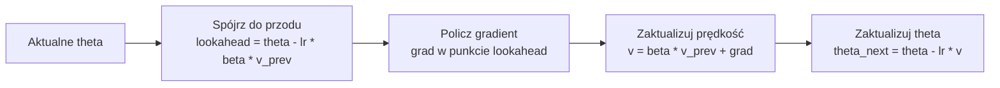

Intuicja:

- metoda sprawdza, czy kierunek rozpędu nadal jest dobry,
- może dawać stabilniejszą i szybszą zbieżność niż klasyczne momentum.

W PyTorch:

```python
optimizer = torch.optim.SGD(
    model.parameters(),
    lr=0.01,
    momentum=0.9,
    nesterov=True,
)
```

---

## 11. Adagrad

Adagrad dostosowuje learning rate osobno dla każdego parametru. Parametry, które często dostają duże gradienty, mają efektywnie mniejszy krok.

Wzory LaTeX:

$$
g_t = \nabla_\theta J(\theta_t)
$$

$$
r_t = r_{t-1} + g_t^2
$$

$$
\theta_{t+1} = \theta_t - \eta \frac{g_t}{\sqrt{r_t} + \epsilon}
$$

Diagram intuicyjny:

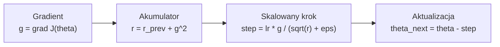

gdzie operacje są wykonywane element po elemencie.

Zalety:

- dobre dla rzadkich cech,
- automatycznie skaluje kroki dla parametrów.

Wady:

- `r_t` stale rośnie,
- efektywny learning rate może stać się bardzo mały.

---

## 12. RMSProp

RMSProp rozwiązuje problem stale rosnącej sumy z Adagrad, używając wykładniczej średniej kwadratów gradientów.

Wzory LaTeX:

$$
g_t = \nabla_\theta J(\theta_t)
$$

$$
r_t = \beta r_{t-1} + (1 - \beta)g_t^2
$$

$$
\theta_{t+1} = \theta_t - \eta \frac{g_t}{\sqrt{r_t} + \epsilon}
$$

Diagram intuicyjny:

```mermaid
flowchart LR
    A["Gradient<br/>g = grad J(theta)"] --> B["Średnia kwadratów gradientu<br/>r = beta * r_prev + (1 - beta) * g^2"]
    B --> C["Skalowany krok<br/>step = lr * g / (sqrt(r) + eps)"]
    C --> D["Aktualizacja<br/>theta_next = theta - step"]
```

Interpretacja:

- `r_t` zapamiętuje skalę ostatnich gradientów,
- parametry z dużymi gradientami dostają mniejsze efektywne kroki,
- metoda dobrze działa w wielu problemach z sieciami neuronowymi.

Typowe hiperparametry:

- `lr`,
- `alpha` albo `beta` dla średniej ruchomej, często około `0.99`,
- `eps`, mała stała stabilizująca, np. `1e-8`.

W PyTorch:

```python
optimizer = torch.optim.RMSprop(model.parameters(), lr=1e-3, alpha=0.99)
```

---

## 13. Adam

Adam łączy idee momentum i RMSProp. Utrzymuje:

- średnią ruchomą gradientów,
- średnią ruchomą kwadratów gradientów.

Wzory LaTeX:

$$
g_t = \nabla_\theta J(\theta_t)
$$

$$
m_t = \beta_1 m_{t-1} + (1 - \beta_1)g_t
$$

$$
v_t = \beta_2 v_{t-1} + (1 - \beta_2)g_t^2
$$

$$
\hat{m}_t = \frac{m_t}{1 - \beta_1^t}
$$

$$
\hat{v}_t = \frac{v_t}{1 - \beta_2^t}
$$

$$
\theta_{t+1} = \theta_t - \eta \frac{\hat{m}_t}{\sqrt{\hat{v}_t} + \epsilon}
$$

Diagram intuicyjny:

```mermaid
flowchart LR
    A["Gradient<br/>g = grad J(theta)"] --> B["Momentum gradientu<br/>m = beta1 * m_prev + (1 - beta1) * g"]
    A --> C["Skala gradientu<br/>v = beta2 * v_prev + (1 - beta2) * g^2"]
    B --> D["Korekcja startu<br/>m_hat = m / (1 - beta1^t)"]
    C --> E["Korekcja startu<br/>v_hat = v / (1 - beta2^t)"]
    D --> F["Krok Adama<br/>step = lr * m_hat / (sqrt(v_hat) + eps)"]
    E --> F
    F --> G["Aktualizacja<br/>theta_next = theta - step"]
```

Ponieważ na początku `m_0 = 0` i `v_0 = 0`, stosuje się korekcję obciążenia (`m_hat`, `v_hat`), żeby pierwsze kroki nie były sztucznie zaniżone.

Intuicja:

- `m_t` działa jak momentum,
- `v_t` skaluje krok według zmienności gradientów,
- Adam zwykle dobrze działa jako pierwszy wybór dla sieci neuronowych.

Typowe hiperparametry:

- `lr=1e-3`,
- `betas=(0.9, 0.999)`,
- `eps=1e-8`,
- `weight_decay=0` albo dodatnie przy regularyzacji.

W PyTorch:

```python
optimizer = torch.optim.Adam(model.parameters(), lr=1e-3)
```

---

## 14. AdamW

AdamW to wariant Adama z odsprzężonym weight decay. W klasycznym Adamie regularyzacja L2 miesza się z adaptacyjnym skalowaniem gradientów, co może działać inaczej niż oczekiwane "zmniejszanie wag".

AdamW wykonuje weight decay bardziej bezpośrednio:

$$
\theta \leftarrow \theta - \eta \cdot weight\_decay \cdot \theta
$$

Diagram intuicyjny:

```mermaid
flowchart LR
    A["Aktualne parametry<br/>theta"] --> B["Odsprzężony weight decay<br/>theta = theta - lr * weight_decay * theta"]
    B --> C["Krok Adama<br/>adaptacyjna aktualizacja z gradientu"]
    C --> D["Nowe parametry<br/>theta_next"]
```

oraz osobno wykonuje adaptacyjną aktualizację Adama.

Kiedy używać:

- często lepszy wybór niż Adam, gdy chcemy regularizować duże sieci,
- popularny w modelach głębokich, szczególnie w transformerach.

W PyTorch:

```python
optimizer = torch.optim.AdamW(
    model.parameters(),
    lr=1e-3,
    weight_decay=1e-2,
)
```

---

## 15. Porównanie optymalizatorów

| Optymalizator | Główna idea | Ważne hiperparametry | Kiedy rozważyć |
|---|---|---|---|
| GD | gradient na całym zbiorze | `lr` | małe dane, analiza teoretyczna |
| SGD | aktualizacje na próbkach lub batchach | `lr`, `batch_size` | klasyczna metoda, dobra generalizacja |
| SGD + momentum | pamięć poprzedniego kierunku | `lr`, `momentum`, `weight_decay` | gdy SGD zbyt mocno zygzakuje |
| RMSProp | adaptacyjny krok na podstawie kwadratów gradientów | `lr`, `alpha`, `eps` | niestacjonarne lub szumiące gradienty |
| Adam | momentum + adaptacyjny learning rate | `lr`, `betas`, `eps`, `weight_decay` | dobry domyślny wybór dla wielu sieci |
| AdamW | Adam z odsprzężonym weight decay | `lr`, `betas`, `weight_decay` | gdy zależy nam na sensownej regularyzacji wag |

---

## 16. Learning rate i harmonogramy uczenia

Learning rate jest jednym z najważniejszych hiperparametrów.

Objawy zbyt dużego `lr`:

- loss rośnie albo skacze,
- model nie zbiega,
- pojawiają się niestabilne predykcje.

Objawy zbyt małego `lr`:

- loss spada bardzo wolno,
- model wymaga wielu epok,
- może zatrzymać się daleko od dobrego minimum.

Popularne harmonogramy:

### Step decay

Co określoną liczbę epok learning rate jest mnożony przez stałą.

$$
lr \leftarrow \gamma \cdot lr
$$

### Exponential decay

Learning rate maleje wykładniczo.

$$
lr_t = lr_0 \cdot \gamma^t
$$

### Cosine annealing

Learning rate maleje według krzywej cosinusowej. Często daje łagodne końcowe dostrajanie.

W PyTorch:

```python
scheduler = torch.optim.lr_scheduler.StepLR(
    optimizer,
    step_size=10,
    gamma=0.1,
)
```

W pętli treningowej:

```python
optimizer.step()
scheduler.step()
```

Uwaga: kolejność może zależeć od konkretnego schedulera, ale dla typowego schedulera epokowego `scheduler.step()` wykonuje się po epoce.

---

## 17. Przykładowa pętla treningowa w PyTorch

```python
model.train()

for x_batch, y_batch in train_loader:
    logits_or_pred = model(x_batch)
    loss = criterion(logits_or_pred, y_batch)

    optimizer.zero_grad()
    loss.backward()
    optimizer.step()
```

Znaczenie kroków:

1. `model.train()` włącza tryb treningowy, np. dropout i batch normalization.
2. `model(x_batch)` wykonuje forward pass.
3. `criterion(...)` oblicza funkcję kosztu.
4. `optimizer.zero_grad()` zeruje gradienty z poprzedniej iteracji.
5. `loss.backward()` liczy gradienty przez backpropagation.
6. `optimizer.step()` aktualizuje parametry.

Dlaczego zerujemy gradienty:

PyTorch domyślnie akumuluje gradienty w polach `.grad`. Jeśli nie wywołamy `zero_grad()`, gradienty z kolejnych batchy będą się sumować.

---

## 18. Typowe błędy na zaliczeniu i w kodzie

### Błąd 1. Softmax przed CrossEntropyLoss

Niepoprawnie:

```python
model = nn.Sequential(
    nn.Linear(20, 3),
    nn.Softmax(dim=1),
)
criterion = nn.CrossEntropyLoss()
```

Poprawnie:

```python
model = nn.Sequential(
    nn.Linear(20, 3),
)
criterion = nn.CrossEntropyLoss()
```

`CrossEntropyLoss` oczekuje logitów i sama wykonuje stabilny odpowiednik `LogSoftmax`.

### Błąd 2. Sigmoid przed BCEWithLogitsLoss

Niepoprawnie:

```python
prob = torch.sigmoid(model(x))
loss = torch.nn.BCEWithLogitsLoss()(prob, y)
```

Poprawnie:

```python
logits = model(x)
loss = torch.nn.BCEWithLogitsLoss()(logits, y)
```

`BCEWithLogitsLoss` sama zawiera sigmoid.

### Błąd 3. Zły typ etykiet dla CrossEntropyLoss

Dla `CrossEntropyLoss` etykiety powinny być typu `torch.long` i mieć kształt `[batch]`.

```python
logits.shape  # [batch, num_classes]
y.shape       # [batch]
y.dtype       # torch.long
```

### Błąd 4. Brak `model.eval()` podczas walidacji

Podczas walidacji:

```python
model.eval()
with torch.no_grad():
    ...
```

Bez `model.eval()` dropout i batch normalization mogą działać jak w treningu, co zaburza ocenę.

---

## 19. Jak dobrać funkcję kosztu i optymalizator

| Problem | Wyjście modelu | Funkcja kosztu | Typowy optymalizator |
|---|---|---|---|
| Regresja | jedna liczba | `MSELoss`, `L1Loss`, `HuberLoss` | Adam, AdamW, SGD |
| Klasyfikacja binarna | jeden logit | `BCEWithLogitsLoss` | Adam, AdamW, SGD |
| Klasyfikacja wieloklasowa | `K` logitów | `CrossEntropyLoss` | Adam, AdamW, SGD |

Praktyczna procedura:

1. Określ typ problemu.
2. Dobierz kształt ostatniej warstwy.
3. Dobierz funkcję kosztu zgodną z wyjściem modelu.
4. Zacznij od Adama lub AdamW z `lr=1e-3`.
5. Jeśli loss jest niestabilny, zmniejsz learning rate.
6. Jeśli model się przeucza, rozważ weight decay, dropout, early stopping albo prostszą architekturę.
7. Raportuj metryki dobrane do problemu, nie tylko wartość funkcji kosztu.

